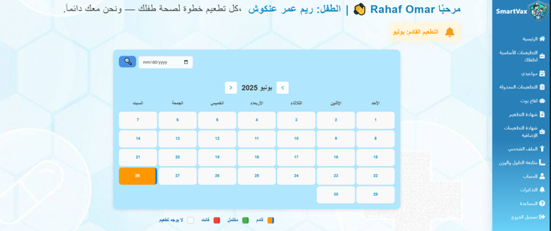
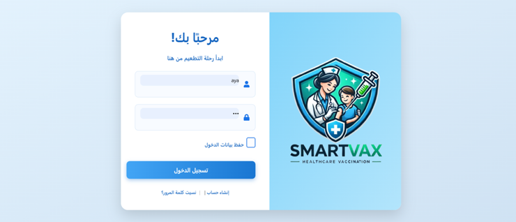
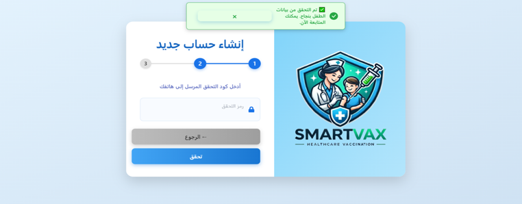
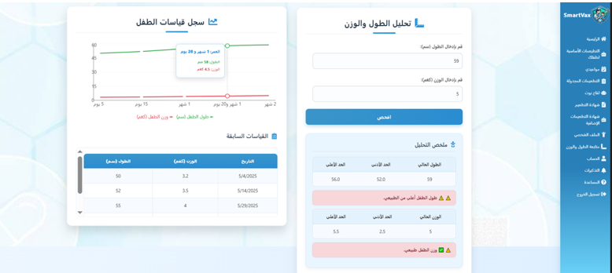
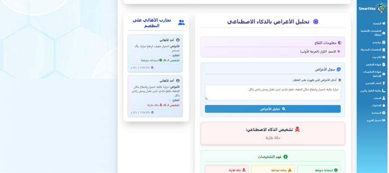
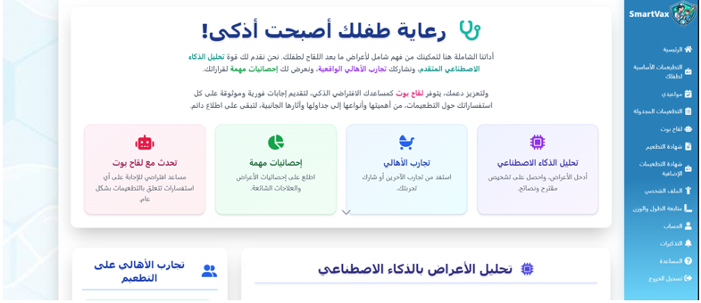

# 💉 SmartVax – Frontend

This is the **React frontend** for the SmartVax system – a vaccination management platform for children.
It provides an intuitive interface for parents and health workers to manage vaccination schedules, view children's health data, and interact with the AI-powered chatbot and feedback analyzer.

It connects to the **SmartVax backend** via RESTful APIs.
This frontend is part of the **COMP4382 Graduation Project at Birzeit University**.

---

## 📥 How to Download the Project

Clone the repository from GitHub:

```bash
git clone https://github.com/AyaHammad12/smartvax-frontend.git
cd smartvax-frontend
```

---

## ▶️ How to Run the Frontend

### ✅ Requirements:

* Node.js 18+
* npm or yarn

### ▶️ Steps:

```bash
npm install
npm start
```

The frontend will run at:
[http://localhost:3000](http://localhost:3000)

---

## 📁 Project Structure

```
src/
├─ components/       # Reusable components (Calendar, DayCell, Navbar, etc.)
├─ pages/            # Main pages (HomePage, Dashboard, AppointmentPage, etc.)
├─ services/         # API service calls
├─ data/             # Mock or static data
├─ App.js            # Main app component
├─ index.js          # Entry point
```

---

## ⭐ Main Features

### 📅 Vaccination Appointment Management

* Parents can view, book, or reschedule appointments.
* Health workers can manage appointments and access scheduling tools.

### 📋 Vaccination Records

* View children’s vaccination history and certificates.
* Integration with backend API for real-time updates.

### 📈 Growth Analysis

* Displays weight and height analysis for children.
* Highlights if measurements are within the normal range.

### 🔔 Reminder System

* Shows upcoming and missed vaccination notifications.
* Visual indicators for critical appointments.

### 💬 AI Chatbot & Feedback

* Chat with the built-in AI chatbot about symptoms.
* Feedback analyzer summarizes parent-submitted responses.

### 🛡️ Role-Based Access

* Different views and functionality for **PARENT**, **HEALTH_WORKER**, and **ADMIN**.

---

## Screenshots

### Home Page


### Login Page


### New Account Registration


### Child Growth Tracking


### Vaccine Info & AI Symptom Tool


### SmartVax Comprehensive Post-Vaccination Care Tool



## 👩‍💻 Team Members

* Hala Qurt
* Aya Hammad
* Asmaa Ankoush

---

## 📝 Notes

* Uses **React Router** for page navigation.
* State management handled with React **Context API** or **Hooks**.
* Connects to SmartVax backend via RESTful APIs.
* Responsive design optimized for desktop and tablet.

---
